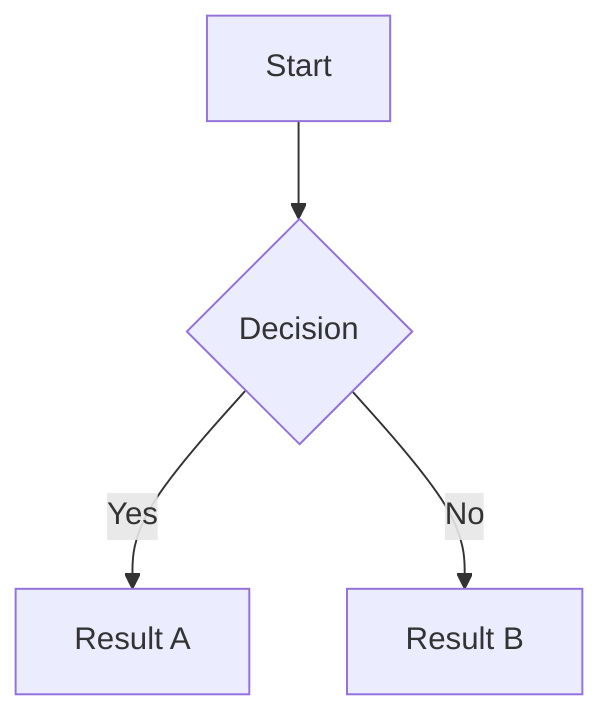

import { Aside } from '@astrojs/starlight/components';
import imgTextEffect from '../../../assets/images/guides/text-effect-preview-01.png';

Markdown is a simple way to format text using special characters. This page covers all the basics you need to know.

<Aside>
You don't need to memorize all of this at once. Bokuchi's [Markdown toolbar](/guides/markdown-toolbar/) lets you apply formatting with buttons — no typing required.
</Aside>

## Headings

Headings create section titles. Use `#` symbols at the beginning of a line.

| Markdown | Result |
|----------|--------|
| `# Heading 1` | Largest heading |
| `## Heading 2` | Second-level heading |
| `### Heading 3` | Third-level heading |
| `#### Heading 4` | Fourth-level heading |
| `##### Heading 5` | Fifth-level heading |
| `###### Heading 6` | Smallest heading |

**When to use:** Use headings to organize your document into sections. The [outline panel](/guides/outline/) will display your heading structure for easy navigation.

## Bold, Italic, and Strikethrough

| Markdown | Result | Use case |
|----------|--------|----------|
| `**bold text**` | **bold text** | Emphasize important words |
| `*italic text*` | *italic text* | Titles, terms, subtle emphasis |
| `~~strikethrough~~` | ~~strikethrough~~ | Show deleted or outdated text |
| `***bold and italic***` | ***bold and italic*** | Strong emphasis |

## Lists

### Bullet Lists

Use `-`, `*`, or `+` at the beginning of each line:

```markdown
- First item
- Second item
  - Nested item
  - Another nested item
- Third item
```

### Numbered Lists

Use numbers followed by a period:

```markdown
1. First step
2. Second step
3. Third step
```

### Checkboxes (Task Lists)

Use `- [ ]` for unchecked and `- [x]` for checked items:

```markdown
- [x] Completed task
- [ ] Pending task
- [ ] Another task
```

<Aside>
In Bokuchi's preview, you can click checkboxes to toggle them on and off — the editor text updates automatically.
</Aside>

<Aside>
When you press Enter inside a list or checkbox item, Bokuchi automatically starts the next item for you. See [Continuous List Input](/guides/editor-and-preview/#continuous-list-input).
</Aside>

## Links and Images

### Links

```markdown
[Link text](https://example.com)
```

### Images

```markdown

```

You can use relative paths for local images or URLs for online images.

<Aside>
You don't have to type image links by hand — drop an image file onto the editor, or paste a screenshot, and Bokuchi inserts the link for you. See [Inserting Images](/guides/editor-and-preview/#inserting-images-by-drag--drop-or-paste).
</Aside>

## Blockquotes

Use `>` at the beginning of a line to create a quote:

```markdown
> This is a blockquote.
> It can span multiple lines.
```

**When to use:** Highlight important information, quote sources, or add notes.

### Alerts (Callouts)

Start a blockquote with a special marker and it becomes a colored callout box with an icon — the same syntax GitHub uses:

```markdown
> [!NOTE]
> Useful information that readers should know, even when skimming.

> [!TIP]
> Helpful advice for doing things better or more easily.

> [!IMPORTANT]
> Key information readers need to know to achieve their goal.

> [!WARNING]
> Urgent info that needs immediate attention to avoid problems.

> [!CAUTION]
> Advises about risks or negative outcomes of certain actions.
```

| Marker | Color | Use case |
|--------|-------|----------|
| `[!NOTE]` | Blue | General information |
| `[!TIP]` | Green | Helpful hints |
| `[!IMPORTANT]` | Purple | Things the reader must not miss |
| `[!WARNING]` | Yellow | Potential problems |
| `[!CAUTION]` | Red | Dangerous or irreversible actions |

A few rules, matching GitHub's behavior:

- The marker must be on its own line, as the first line of the quote. `> [!NOTE] extra text` stays a plain quote
- The alert needs at least one line of body text after the marker
- The marker is not case-sensitive — `[!note]` works too
- Only top-level quotes become alerts. A quote nested inside a list or inside another quote stays plain

Alerts also appear in [HTML and PDF exports](/guides/export/). The titles (Note, Tip, and so on) are always shown in English, just like on GitHub.

## Code

### Inline Code

Wrap text in backticks for inline code: `` `code here` ``

### Code Blocks

Use triple backticks for multi-line code. Specify a language for syntax highlighting:

````markdown
```javascript
function hello() {
  console.log("Hello, world!");
}
```
````

Bokuchi supports syntax highlighting for over 190 programming languages.

#### File Names on Code Blocks

Add a colon and a file name after the language, and the code block shows the file name as a label in its top-left corner — handy when a document walks through several files:

````markdown
```ts:src/index.ts
export const greeting = "Hello";
```
````

The part before the colon (`ts` here) is still used for syntax highlighting, and the part after it becomes the label. To show a label without any highlighting, leave the language out: ` ```:README `. The label also appears in [HTML and PDF exports](/guides/export/). This is the same `language:filename` syntax used on Qiita. Marp slides don't show the label.

## Tables

Use pipes `|` and dashes `-` to create tables:

```markdown
| Name    | Role     | Status  |
|---------|----------|---------|
| Alice   | Designer | Active  |
| Bob     | Engineer | Active  |
```

<Aside>
You can also paste HTML tables or CSV/TSV data into Bokuchi and they will be automatically converted to Markdown tables. See [Table Conversion](/guides/table-conversion/) for details.
</Aside>

## Horizontal Rules

Create a divider line with three or more dashes:

```markdown
---
```

## Emoji Shortcodes

Type an emoji name between colons and the preview shows the emoji:

```markdown
Launch day! :rocket: :tada:
```

Result: Launch day! 🚀 🎉

Bokuchi understands the same shortcodes as GitHub, so any name that works in a GitHub comment works here. Shortcodes are converted in the preview and in [HTML and PDF exports](/guides/export/); the text in your file stays as you typed it.

- Names are lowercase — `:ROCKET:` stays as text
- Unknown names are shown as-is
- Shortcodes inside inline code or code blocks are never converted

If you'd rather keep shortcodes as plain text, turn off **Emoji Shortcodes** in [Settings](/guides/settings/) > Advanced > Rendering Extensions.

## Math Expressions (KaTeX)

When KaTeX is enabled in [Settings](/guides/settings/) > Advanced > Rendering Extensions, you can render math expressions.

**Inline math** — wrap with single dollar signs:

```markdown
The formula $E = mc^2$ is well known.
```

**Display math** — wrap with double dollar signs:

```markdown
$$
\sum_{i=1}^{n} x_i
$$
```

## Diagrams (Mermaid)

When Mermaid is enabled in [Settings](/guides/settings/) > Advanced > Rendering Extensions, you can create diagrams using ` ```mermaid ` fenced code blocks.

````markdown

````

Mermaid supports flowcharts, sequence diagrams, class diagrams, state diagrams, and more.

## Text Effects (Bokuchi Only)

<Aside type="caution">
Text effects are a Bokuchi-specific feature and are not part of standard Markdown. Content using this syntax will not render as effects in other editors or platforms.
</Aside>

Bokuchi supports special visual effects in the preview. Wrap content between `:::effectName` and `:::` markers:

````markdown
:::rainbow
This text displays in rainbow colors.
:::
````

Available effects:

| Effect | Description |
|--------|-------------|
| `shake` | Text shakes back and forth |
| `rainbow` | Text cycles through rainbow colors |
| `glow` | Text pulses with a glow effect |
| `bounce` | Text bounces up and down |
| `blink` | Text blinks on and off |


<Aside>
Text effects are only visible in the preview — the source Markdown remains unchanged.
</Aside>

## Next Steps

- [Markdown toolbar](/guides/markdown-toolbar/) — Apply formatting using buttons
- [Markdown cheatsheet](/reference/markdown-cheatsheet/) — Quick reference card
- [Editor and preview](/guides/editor-and-preview/) — Learn about the editing experience
