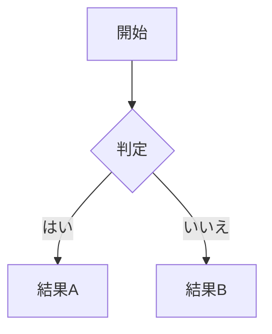

import { Aside } from '@astrojs/starlight/components';

Markdown は、特殊な記号を使ってテキストを装飾するシンプルな書き方です。このページでは、基本的な記法をすべて紹介します。

<Aside>
すべてを一度に覚える必要はありません。Bokuchi の[ツールバー](/ja/guides/markdown-toolbar/)を使えば、ボタンをクリックするだけで書式を適用できます。
</Aside>

## 見出し

見出しは文書をセクションに分けるために使います。行の先頭に `#` を付けます。

| 記法 | 結果 |
|------|------|
| `# 見出し1` | 最も大きな見出し |
| `## 見出し2` | 2番目の見出し |
| `### 見出し3` | 3番目の見出し |
| `#### 見出し4` | 4番目の見出し |
| `##### 見出し5` | 5番目の見出し |
| `###### 見出し6` | 最も小さな見出し |

**使い方：** 見出しで文書を構造化すると、[アウトラインパネル](/ja/guides/outline/)に見出し構造が表示され、簡単にナビゲーションできます。

## 太字・斜体・取り消し線

| 記法 | 結果 | 用途 |
|------|------|------|
| `**太字**` | **太字** | 重要な語句を強調 |
| `*斜体*` | *斜体* | タイトル、用語、やや控えめな強調 |
| `~~取り消し線~~` | ~~取り消し線~~ | 削除済み・古い情報を示す |
| `***太字かつ斜体***` | ***太字かつ斜体*** | 特に強い強調 |

## リスト

### 箇条書きリスト

行の先頭に `-`、`*`、`+` を付けます：

```markdown
- 項目1
- 項目2
  - ネストされた項目
  - もう一つのネスト
- 項目3
```

### 番号付きリスト

数字とピリオドを付けます：

```markdown
1. 最初の手順
2. 次の手順
3. 最後の手順
```

### チェックボックス（タスクリスト）

`- [ ]` で未チェック、`- [x]` でチェック済みの項目を作れます：

```markdown
- [x] 完了したタスク
- [ ] 未完了のタスク
- [ ] もう一つのタスク
```

<Aside>
Bokuchi のプレビューでは、チェックボックスをクリックして切り替えることができます。エディタのテキストも自動的に更新されます。
</Aside>

## リンクと画像

### リンク

```markdown
[リンクテキスト](https://example.com)
```

### 画像

```markdown

```

ローカル画像には相対パス、オンライン画像には URL を使えます。

## 引用

行の先頭に `>` を付けると引用になります：

```markdown
> これは引用です。
> 複数行にまたがることもできます。
```

**使い方：** 重要な情報の強調、出典の引用、注釈に便利です。

## コード

### インラインコード

バッククォートで囲みます：`` `コード` ``

### コードブロック

3つのバッククォートで囲みます。言語名を指定するとシンタックスハイライトが適用されます：

````markdown
```javascript
function hello() {
  console.log("Hello, world!");
}
```
````

Bokuchi は 190 以上のプログラミング言語のシンタックスハイライトに対応しています。

## テーブル（表）

パイプ `|` とダッシュ `-` で表を作成します：

```markdown
| 名前    | 役割     | 状態   |
|---------|----------|--------|
| Alice   | デザイナー | 在籍  |
| Bob     | エンジニア | 在籍  |
```

<Aside>
HTML テーブルや CSV/TSV データを Bokuchi にペーストすると、自動的に Markdown テーブルに変換できます。詳しくは[テーブル変換](/ja/guides/table-conversion/)をご覧ください。
</Aside>

## 水平線

3つ以上のダッシュで区切り線を作成します：

```markdown
---
```

## 数式（KaTeX）

[設定](/ja/guides/settings/) > 詳細設定 > レンダリング拡張 で KaTeX を有効にすると、数式をレンダリングできます。

**インライン数式** — 単一のドル記号で囲みます：

```markdown
公式 $E = mc^2$ はよく知られています。
```

**ブロック数式** — 二重のドル記号で囲みます：

```markdown
$$
\sum_{i=1}^{n} x_i
$$
```

## 図表（Mermaid）

[設定](/ja/guides/settings/) > 詳細設定 > レンダリング拡張 で Mermaid を有効にすると、` ```mermaid ` コードブロックで図表を作成できます。

````markdown

````

フローチャート、シーケンス図、クラス図、状態遷移図など、さまざまな図表に対応しています。

## 次のステップ

- [Markdown ツールバー](/ja/guides/markdown-toolbar/) — ボタンで書式を適用する
- [Markdown チートシート](/ja/reference/markdown-cheatsheet/) — クイックリファレンス
- [エディタとプレビュー](/ja/guides/editor-and-preview/) — 編集体験について学ぶ
