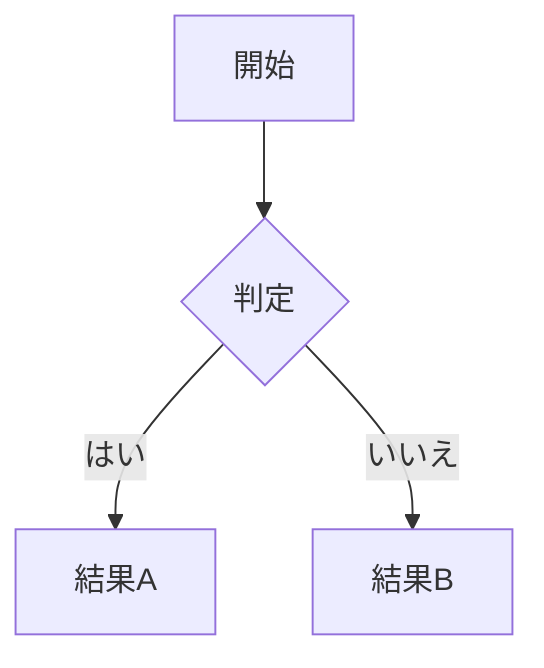

import { Aside } from '@astrojs/starlight/components';
import imgTextEffect from '../../../../assets/images/guides/text-effect-preview-01.png';

Markdown は、特殊な記号を使ってテキストを装飾するシンプルな書き方です。このページでは、基本的な記法をすべて紹介します。

<Aside>
すべてを一度に覚える必要はありません。Bokuchi の[ツールバー](/ja/guides/markdown-toolbar/)を使えば、ボタンをクリックするだけで書式を適用できます。
</Aside>

## 見出し

見出しは文書をセクションに分けるために使います。行の先頭に `#` を付けます。

| 記法 | 結果 |
|------|------|
| `# 見出し1` | 最も大きな見出し |
| `## 見出し2` | 2番目の見出し |
| `### 見出し3` | 3番目の見出し |
| `#### 見出し4` | 4番目の見出し |
| `##### 見出し5` | 5番目の見出し |
| `###### 見出し6` | 最も小さな見出し |

**使い方：** 見出しで文書を構造化すると、[アウトラインパネル](/ja/guides/outline/)に見出し構造が表示され、簡単にナビゲーションできます。

## 太字・斜体・取り消し線

| 記法 | 結果 | 用途 |
|------|------|------|
| `**太字**` | **太字** | 重要な語句を強調 |
| `*斜体*` | *斜体* | タイトル、用語、やや控えめな強調 |
| `~~取り消し線~~` | ~~取り消し線~~ | 削除済み・古い情報を示す |
| `***太字かつ斜体***` | ***太字かつ斜体*** | 特に強い強調 |

## リスト

### 箇条書きリスト

行の先頭に `-`、`*`、`+` を付けます：

```markdown
- 項目1
- 項目2
  - ネストされた項目
  - もう一つのネスト
- 項目3
```

### 番号付きリスト

数字とピリオドを付けます：

```markdown
1. 最初の手順
2. 次の手順
3. 最後の手順
```

### チェックボックス（タスクリスト）

`- [ ]` で未チェック、`- [x]` でチェック済みの項目を作れます：

```markdown
- [x] 完了したタスク
- [ ] 未完了のタスク
- [ ] もう一つのタスク
```

<Aside>
Bokuchi のプレビューでは、チェックボックスをクリックして切り替えることができます。エディタのテキストも自動的に更新されます。
</Aside>

<Aside>
リストやチェックボックスの中で Enter を押すと、次の項目が自動で始まります。詳しくは[リスト・チェックボックスの連続入力](/ja/guides/editor-and-preview/#リストチェックボックスの連続入力)をご覧ください。
</Aside>

## リンクと画像

### リンク

```markdown
[リンクテキスト](https://example.com)
```

### 画像

```markdown

```

ローカル画像には相対パス、オンライン画像には URL を使えます。

<Aside>
画像リンクは手で入力しなくても大丈夫です。画像ファイルをエディタにドロップするか、スクリーンショットを貼り付けると、Bokuchi がリンクを挿入してくれます。詳しくは[画像の挿入](/ja/guides/editor-and-preview/#ドラッグドロップや貼り付けで画像を挿入)をご覧ください。
</Aside>

## 引用

行の先頭に `>` を付けると引用になります：

```markdown
> これは引用です。
> 複数行にまたがることもできます。
```

**使い方：** 重要な情報の強調、出典の引用、注釈に便利です。

### アラート（注意書き）

引用の先頭に特別なマーカーを付けると、アイコン付きの色分けされた注意書きボックスになります。GitHub と同じ記法です：

```markdown
> [!NOTE]
> 流し読みでも押さえておいてほしい補足情報。

> [!TIP]
> より上手に、より簡単に進めるためのヒント。

> [!IMPORTANT]
> 目的を達成するために必ず知っておくべき重要な情報。

> [!WARNING]
> 問題を避けるために、すぐに注意が必要な情報。

> [!CAUTION]
> 操作によるリスクや悪い結果についての注意。
```

| マーカー | 色 | 用途 |
|---------|-----|------|
| `[!NOTE]` | 青 | 一般的な補足情報 |
| `[!TIP]` | 緑 | 役立つヒント |
| `[!IMPORTANT]` | 紫 | 見落としてはいけない事項 |
| `[!WARNING]` | 黄 | 起こりうる問題 |
| `[!CAUTION]` | 赤 | 危険な操作や取り消せない操作 |

GitHub と同じ、いくつかのルールがあります：

- マーカーは引用の 1 行目に、単独で書きます。`> [!NOTE] 追加のテキスト` は普通の引用のままです
- マーカーの後に、1 行以上の本文が必要です
- 大文字・小文字は区別しません。`[!note]` でも動作します
- アラートになるのは最上位の引用だけです。リストや別の引用の中にある引用は普通の引用のままです

アラートは [HTML / PDF エクスポート](/ja/guides/export/)にも反映されます。タイトル（Note、Tip など）は GitHub と同様、常に英語で表示されます。

## コード

### インラインコード

バッククォートで囲みます：`` `コード` ``

### コードブロック

3つのバッククォートで囲みます。言語名を指定するとシンタックスハイライトが適用されます：

````markdown
```javascript
function hello() {
  console.log("Hello, world!");
}
```
````

Bokuchi は 190 以上のプログラミング言語のシンタックスハイライトに対応しています。

## テーブル（表）

パイプ `|` とダッシュ `-` で表を作成します：

```markdown
| 名前    | 役割     | 状態   |
|---------|----------|--------|
| Alice   | デザイナー | 在籍  |
| Bob     | エンジニア | 在籍  |
```

<Aside>
HTML テーブルや CSV/TSV データを Bokuchi にペーストすると、自動的に Markdown テーブルに変換できます。詳しくは[テーブル変換](/ja/guides/table-conversion/)をご覧ください。
</Aside>

## 水平線

3つ以上のダッシュで区切り線を作成します：

```markdown
---
```

## 絵文字ショートコード

絵文字の名前をコロンで挟むと、プレビューに絵文字が表示されます：

```markdown
リリース日！ :rocket: :tada:
```

結果： リリース日！ 🚀 🎉

Bokuchi は GitHub と同じショートコードを理解します。GitHub のコメントで使える名前なら、そのまま使えます。変換されるのはプレビューと [HTML / PDF エクスポート](/ja/guides/export/)で、ファイルの中身は入力したままです。

- 名前は小文字で書きます。`:ROCKET:` はテキストのまま表示されます
- 知らない名前はそのまま表示されます
- インラインコードやコードブロックの中のショートコードは変換されません

ショートコードをそのままの文字で残したい場合は、[設定](/ja/guides/settings/) > 詳細設定 > レンダリング拡張 の **絵文字ショートコード** をオフにしてください。

## 数式（KaTeX）

[設定](/ja/guides/settings/) > 詳細設定 > レンダリング拡張 で KaTeX を有効にすると、数式をレンダリングできます。

**インライン数式** — 単一のドル記号で囲みます：

```markdown
公式 $E = mc^2$ はよく知られています。
```

**ブロック数式** — 二重のドル記号で囲みます：

```markdown
$$
\sum_{i=1}^{n} x_i
$$
```

## 図表（Mermaid）

[設定](/ja/guides/settings/) > 詳細設定 > レンダリング拡張 で Mermaid を有効にすると、` ```mermaid ` コードブロックで図表を作成できます。

````markdown

```mermaid
graph TD
    A[開始] --> B{判定}
    B -->|はい| C[結果A]
    B -->|いいえ| D[結果B]
```
````

フローチャート、シーケンス図、クラス図、状態遷移図など、さまざまな図表に対応しています。

## テキストエフェクト（Bokuchi 独自機能）

<Aside type="caution">
テキストエフェクトは Bokuchi 独自の機能であり、標準的な Markdown の仕様には含まれていません。この記法を使ったコンテンツは、他のエディタやプラットフォームではエフェクトとして表示されません。
</Aside>

Bokuchi のプレビューでは、特殊な視覚効果を適用できます。`:::エフェクト名` と `:::` でコンテンツを囲みます：

````markdown
:::rainbow
このテキストが虹色に表示されます。
:::
````

使用可能なエフェクト：

| エフェクト | 説明 |
|-----------|------|
| `shake` | テキストが左右に揺れます |
| `rainbow` | テキストが虹色に変化します |
| `glow` | テキストが光るように明滅します |
| `bounce` | テキストが上下にバウンスします |
| `blink` | テキストが点滅します |


<Aside>
テキストエフェクトはプレビューでのみ表示されます。ソースの Markdown はそのまま保持されます。
</Aside>

## 次のステップ

- [Markdown ツールバー](/ja/guides/markdown-toolbar/) — ボタンで書式を適用する
- [Markdown チートシート](/ja/reference/markdown-cheatsheet/) — クイックリファレンス
- [エディタとプレビュー](/ja/guides/editor-and-preview/) — 編集体験について学ぶ
