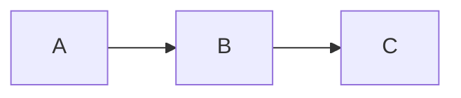

印刷して手元に置いても便利な、よく使う Markdown 記法のクイックリファレンスです。

## テキスト装飾

| 記法 | 結果 |
|------|------|
| `**太字**` | **太字** |
| `*斜体*` | *斜体* |
| `~~取り消し線~~` | ~~取り消し線~~ |
| `` `インラインコード` `` | `インラインコード` |

## 見出し

```markdown
# 見出し1
## 見出し2
### 見出し3
#### 見出し4
##### 見出し5
###### 見出し6
```

## リスト

```markdown
- 箇条書き
- もう一つの項目
  - ネストされた項目

1. 番号付き項目
2. もう一つの項目

- [x] チェック済み
- [ ] 未チェック
```

## リンクと画像

```markdown
[リンクテキスト](https://example.com)

```

## 引用

```markdown
> これは引用です。
> 複数行にまたがることもできます。
```

## コードブロック

````markdown
```言語名
コードをここに書きます
```
````

## テーブル

```markdown
| 見出し1 | 見出し2 |
|---------|---------|
| セル1   | セル2   |
| セル3   | セル4   |
```

## 水平線

```markdown
---
```

## Bokuchi 独自機能: 変数

```markdown
<!-- @var name: 値 -->
テキスト内に {{name}} のプレースホルダーを配置。
```

詳しくは[変数システム](/ja/guides/variables/)をご覧ください。

## Bokuchi 独自機能: 数式（KaTeX）

```markdown
インライン: $E = mc^2$

ブロック:

$$
\sum_{i=1}^{n} x_i
$$
```

設定 > 詳細設定 > レンダリング拡張 で有効にできます。

## Bokuchi 独自機能: 図表（Mermaid）

````markdown

````

設定 > 詳細設定 > レンダリング拡張 で有効にできます。

## Bokuchi 独自機能: テキストエフェクト

`:::エフェクト名` と `:::` でコンテンツを囲むと、プレビューで視覚効果が適用されます。

```markdown
:::shake
このテキストが揺れます！
:::

:::rainbow
虹色のテキスト。
:::
```

使用可能なエフェクト: `shake`, `rainbow`, `glow`, `bounce`, `blink`
